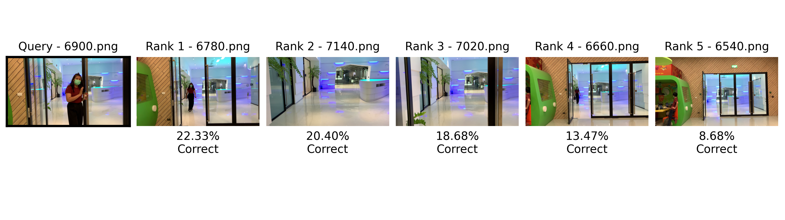
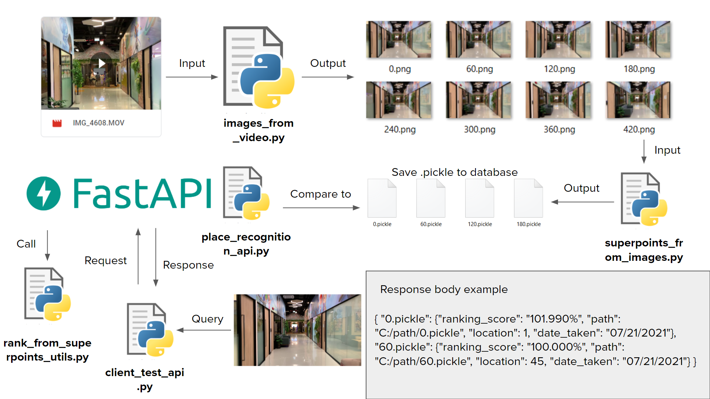
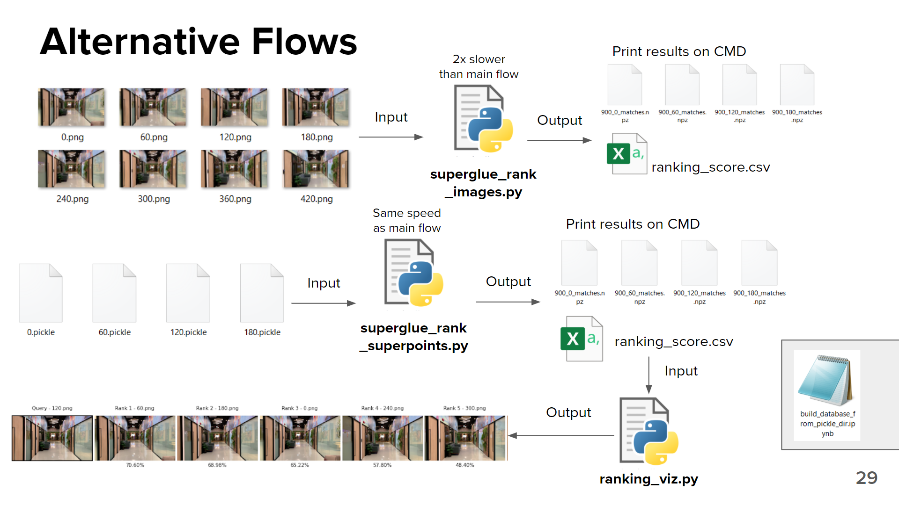

# SuperGlue for Visual Place Recognition

## Introduction
&nbsp;&nbsp;&nbsp;&nbsp;We use SuperGlue and SuperPoint for VPR (Visual Place Recognition) task answering the question "Given a query image, where is this place in the map?".

Original SuperGlue works by Magic Leap Team, please see:

* Github repo: [SuperGluePretrainedNetwork](https://github.com/magicleap/SuperGluePretrainedNetwork)

* Full paper PDF: [SuperGlue: Learning Feature Matching with Graph Neural Networks](https://arxiv.org/abs/1911.11763).

* Authors: *Paul-Edouard Sarlin, Daniel DeTone, Tomasz Malisiewicz, Andrew Rabinovich*

* Website: [psarlin.com/superglue](https://psarlin.com/superglue) for videos, slides, recent updates, and more visualizations.

* `hloc`: a new toolbox for visual localization and SfM with SuperGlue, available at [cvg/Hierarchical-Localization](https://github.com/cvg/Hierarchical-Localization/). Winner of 3 CVPR 2020 competitions on localization and image matching!

## Dependencies
* Python 3
* PyTorch 
* OpenCV (4.1.2.30 recommended for best GUI keyboard interaction, see this [note](#additional-notes))
* Matplotlib
* NumPy 
* Pandas
* FastAPI
* uvicorn

Simply run the following command: `pip3 install numpy pandas opencv-python torch matplotlib fastapi uvicorn`

## Contents
&nbsp;&nbsp;&nbsp;&nbsp;We have contributed these 9 files for VPR task and utilities in addition to original files from original Github repo (examples of usage will be described and provided below sections):

1. `image_from_video.py`: extract frame from videos and save out as image files
2. `superpoints_from_images.py`: extract SuperPoint keypoints from images and save as pickle files
3. `superglue_rank_superpoints_file.py`: do image matching and ranking from SuperPoint keypoints .pickle files using SuperGlue 
4. `superglue_rank_images.py`: do image matching and ranking from images files using SuperGlue 
5. `ranking_viz.py`: visualize the ranking results and save output as a image
6. `rank_from_superpoints_utils.py`: refactored code version of `superglue_rank_superpoints_file.py` in order to use for building an API
7. `place_recognition_api.py`: server side of API built with FastAPI
8. `client_test_api.py`: client side API request example
9. `build_database_from_pickle_dir.ipynb`: example of code for building easy database .csv file for testing SuperGlue for VPR tasks

## Usage
&nbsp;&nbsp;&nbsp;&nbsp;In this section, we will explain how to execute each file. For full workflow of every file, please go to the next section.
**Note:** you can always run `python (file_name).py -h` or `python (file_name).py --help` for every file receiving arguments to see what arguments you need to pass in (or open the file on our preferred editor and read from the source code)  
**Note 2:** Feel free to edit anything to achieve your desired results!  
  
1. **`image_from_video.py`** Command line arguements:  
* `--input (or -i)` Path to input video
* `--output (or -o)` Path to directory to save images
* `--skip (or -s)` Number of frame to skip, in the other words, save every n frame (default: 60)
* `--format (or -f)` Image file format for saving (only 2 options available 'jpg' or 'png')  

&nbsp;&nbsp;&nbsp;&nbsp;**Example usage:** `python image_from_video.py -i video/country_road.MOV -o saved_frame -s 60 -f png` by running this, the code will save every 60 frames from country_road.MOV in video folder into saved_frame folder in the current working directory as .png files

2. **`superpoints_from_images.py`** Command line arguements:  
* `--input_dir` Input directory of images to be processed
* `--output_dir` Output directory to save SuperPoints data
* `--max_keypoints` Maximum number of keypoints detected by Superpoint ('-1' keeps all keypoints) (default: 1024)
* `--keypoint_threshold` SuperPoint keypoint detector confidence threshold (default: 0.005)
* `--nms_radius` SuperPoint Non Maximum Suppression (NMS) radius (Must be positive) (default: 4)
* `--resize` Resize the input image before running inference. Two numbers required. (default: 640x480)
* `--cuda` Use cuda GPU to speed up network processing speed (default: False)

&nbsp;&nbsp;&nbsp;&nbsp;**Example usage:** `python superpoints_from_images.py --input_dir test_realdata --output_dir saved_superpoints/pickle/test_realdata --resize 320 240 --cuda` by running this, the code will resize images to 320x240 and extract SuperPoints from images in `test_realdata` folder using CUDA. Then, save to `saved_superpoints/pickle/test_realdata` folder.

3. **`superglue_rank_superpoints_file.py`** Command line arguements:  
* `--query (or -q)` Name of query pickle inside input_dir folder (it must be one of pickle in the input_dir folder) This file does not support inputting image from outside directory. If you wish to do so, use API which we will explain later here.
* `--input_dir (or -i)` Path to database pickle directory
* `--output_dir (or -o)` Path to store .npz files (resuls from matching)
* `--image_size` Image size used to resize image with SuperPoints. If you didn\'t specify resize when running superpoints_from_images.py file. Please enter 640 480. (format: width x height)
* `--max_length` Maximum number of pairs to evaluate. -1 is no maximum. (default: -1)
* `--superglue` SuperGlue weights. There are 2 options available which are `indoor` or `outdoor`. (default: `indoor`)
* `--sinkhorn_iterations` Number of Sinkhorn iterations performed by SuperGlue (default: 20)
* `--match_threshold` SuperGlue match threshold (default: 0.2)
* `--cuda` Use cuda GPU to speed up network processing speed (default: False)

&nbsp;&nbsp;&nbsp;&nbsp;**Example usage:** `python superglue_rank_superpoints_file.py -q 60.pickle -i saved_superpoints/pickle/test_realdata -o rank_output/rank_output_test_realdata --image_size 320 240 --cuda` by running this, the code will rank the SuperPoints file according to the query file and output the ranking result in the command line, save the match output to the output directory, and output `ranking_score.csv` (the result of ranking in csv format) using CUDA.

4. **`superglue_rank_images.py`** Command line arguements:  
* `--query (or -q)` Name of query image inside input_dir folder (it must be one of image in the input_dir folder) This file does not support inputting image from outside directory. If you wish to do so, use API which we will explain later here.
* `--input_dir (or -i)` Path to database image directory
* `--output_dir (or -o)` Path to store .npz files and ranking_score.csv (resuls from matching)
* `--max_length` Maximum number of pairs to evaluate. -1 is no maximum. (default: -1)
* `--resize` Resize the input image before running inference. Two numbers required. (default: 640x480) 
* `--resize_float` Resize the image after casting uint8 to float (default: Fakse)
* `--superglue` SuperGlue weights. There are 2 options available which are `indoor` or `outdoor`. (default: `indoor`)
* `--max_keypoints` Maximum number of keypoints detected by Superpoint ('-1' keeps all keypoints) (default: 1024)
* `--keypoint_threshold` SuperPoint keypoint detector confidence threshold (default: 0.005)
* `--viz` Visualize the matches and dump the plots (default: False)
* `--nms_radius` SuperPoint Non Maximum Suppression (NMS) radius (Must be positive) (default: 4)
* `--sinkhorn_iterations` Number of Sinkhorn iterations performed by SuperGlue (default: 20)
* `--match_threshold` SuperGlue match threshold (default: 0.2)
* `--force_cpu` Force pytorch to run in CPU mode (default: False)
* `--viz_extension` Visualization file extension. Use pdf for highest-quality. There are 2 options which are 'png' and 'pdf'. (default: png)
* `--fast_viz` Use faster image visualization with OpenCV instead of Matplotlib (default: False)
* `--show_keypoints` Plot the keypoints in addition to the matches (default: False)
* `--opencv_display` Visualize via OpenCV before saving output images (default: False)

&nbsp;&nbsp;&nbsp;&nbsp;**Example usage:** `python superglue_rank_images.py -q 60.png -i test_realdata -o rank_output/rank_output_test_realdata_images --resize 320 240 --resize_float --viz --viz_extension png --fast_viz --show_keypoints` by running this, the code will rank the images according to the image query, do the visualization, show the keypoints, and output the ranking result in the command line, save the match output to the output directory, and output `ranking_score.csv` (the result of ranking in csv format) using CUDA.

5. **`ranking_viz.py`** Command line arguements:  
* `--query (or -q)` Name of query image (in the ranking_result that you did ranking from other files)
* `--input_csv (or -i)` Path to ranking result (.csv file) from matching result directory
* `--input_dir (or -id)` Path to original image directory
* `--input_extension` Extension of image in input_dir. There are 2 options which are 'jpg' and 'png'. (default: png)
* `--output_extension` Extension of output visualization image. There are 2 options which are 'jpg' and 'png'. (default: png)
* `--rank (or -r)`Number of rank to show (default: 5)

&nbsp;&nbsp;&nbsp;&nbsp;**Example usage:** `python ranking_viz.py -q 60.png -i test_realdata/ranking_score.csv -id test_realdata --input_extension png --output_extension png -r 10` by running this, the code will visualize the result following the number of rank specify in -r. For example:  


6. **`rank_from_superpoints_utils.py`** This code is the refactored code version of `superglue_rank_superpoints_file.py` in order to use for building an API. So, you don't need to do anything with this file

7. **`place_recognition_api.py`** Run `uvicorn place_recognition_api:app` and go to the port showing in the command line. With the fact that we built this API with FastAPI, you can type `/docs` after the port number to go to the doc and test all route. *Note: You will see a lot of online resources adding --reload at the end after :app, but we don't do this here because at the runtime there will be 1 file created named `rank_pairs.txt` for matching to work properly. If you specify --reload, the app api will be reload every time the new file created. This can lead to error and infinite loop* 

8. **`client_test_api.py`** Basically run `python client_test_api.py` to test whether the API works properly. You can change the file name and rank parameter in the source code file to test with other images and sets of parameters. If you want to POST from other files, don't forget to POST to `/do_ranking/` route. The main `/` and `/items/` are there just for testing purpose.

9. **`build_database_from_pickle_dir.ipynb`** This is the minimum example of .csv database file. You can take a look into the source code and run all cells or you can build it on your own.

## Full workflow (main workflow)
1. Run `images_from_video.py` by passing your input video of your map/place, then you will get the output as a bunch of images in the specified output folder.
2. Run `superpoints_from_images.py` by inputting the folder of images you got from step 1. You will get the output as a bunch of .pickle files storing SuperPoints from those input images.
3. (This step is not in the image below) Use `build_database_from_pickle_dir.ipynb` as you baseline to build your database and save as .csv with the name `superpoints_database.csv` (if you want to use other names, please go to the source code and change **line 14**)
4. Run `place_recognition_api.py` with the command from previous section.
5. Go to `port/docs` to test your API or use `client_test_api.py` to test. The API get request as 1 image file and 1 parameter named `rank` which indicates how many rank you want to get in the result.
6. After you test ranking on API and it works fine, you should see a new folder in your current working directory named `api_output` which contains the matching results and `ranking_score.csv` which can be used for visualization with `ranking_viz.py`. If you see this new folder, congratulations! everything works properly.
7. That's it! The full image of the workflow is provided below and also the expected response body.   


## Alternative workflows
* **Alternative #1** -> After step 1 in the main flow, you can run `superglue_rank_images.py` by inputting the folder of images you got from step 1. You'll get the ranking result printed in command line, matching output files, and `ranking_score.csv`. But if you use this flow, the execution time will be 2x slower since your code has to run both SuperPoint and SuperGlue.
* **Alternative #2** -> After step 2 in the main flow, you can run `superglue_rank_superpoints`by inputting the folder of SuperPoints you got from step 2. Again, you'll get the ranking result printed in command line, matching output files, and `ranking_score.csv`. Using this flow, the time execution will be the same as the main flow, but there is no support for end-to-end API.
* **From both Alternative #1 and #3 or the main flow**, after you get `ranking_score.csv` from running code, you can run `ranking_viz.py` to see the visualization result.  
**Note:** The extra file `build_database_from_pickle_dir.ipynb` is just for demonstrating how database should look like. But feel free to desgin database as you wish, and if you do so, you must adjust the source code in `place_recognition_api.py` unless it will cause errors.  


## BibTeX Citation
If you use any ideas from the paper or code from this repo, please consider citing:

```txt
@inproceedings{sarlin20superglue,
  author    = {Paul-Edouard Sarlin and
               Daniel DeTone and
               Tomasz Malisiewicz and
               Andrew Rabinovich},
  title     = {{SuperGlue}: Learning Feature Matching with Graph Neural Networks},
  booktitle = {CVPR},
  year      = {2020},
  url       = {https://arxiv.org/abs/1911.11763}
}
```

## Legal Disclaimer
Magic Leap is proud to provide its latest samples, toolkits, and research projects on Github to foster development and gather feedback from the spatial computing community. Use of the resources within this repo is subject to (a) the license(s) included herein, or (b) if no license is included, Magic Leap's [Developer Agreement](https://id.magicleap.com/terms/developer), which is available on our [Developer Portal](https://developer.magicleap.com/).
If you need more, just ask on the [forums](https://forum.magicleap.com/hc/en-us/community/topics)!
We're thrilled to be part of a well-meaning, friendly and welcoming community of millions.
